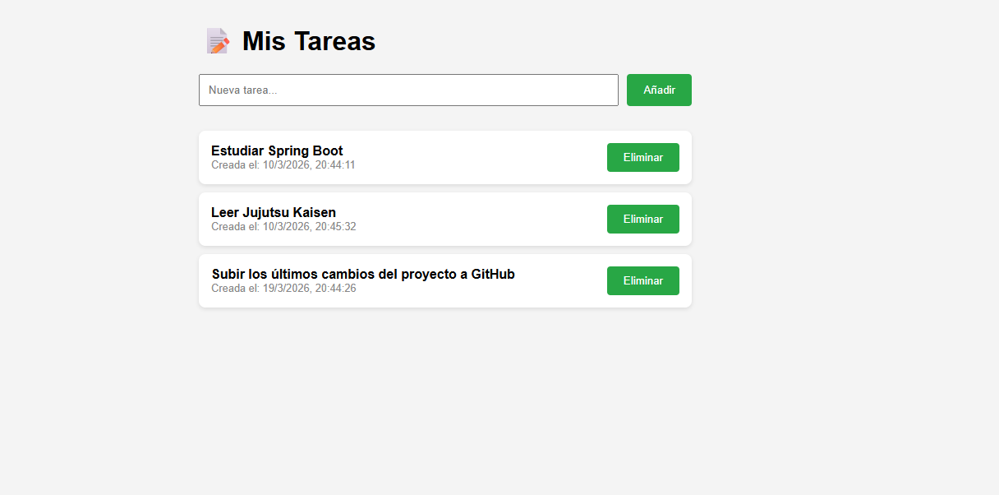
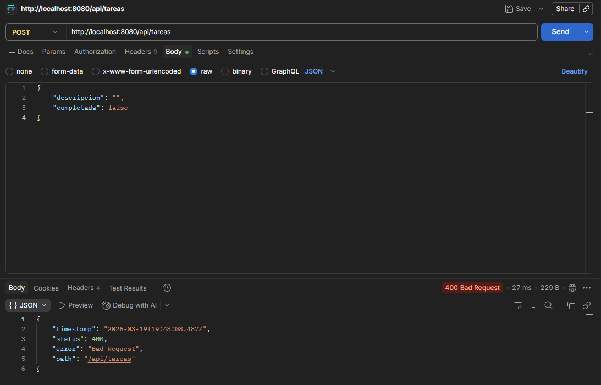

# 📝 Gestión de Tareas Full-Stack (Spring Boot + JS)

Una aplicación web completa para la gestión de tareas pendientes, desarrollada con un backend robusto en Java y una interfaz dinámica en el frontend.

---

## 🚀 Características Principales

- **API RESTful:** Implementación de operaciones CRUD completas (Create, Read, Update, Delete).
- **Validación de Datos:** Uso de `jakarta.validation` para asegurar que las tareas tengan descripciones válidas y no vacías.
- **Auditoría de Datos:** Registro automático de la fecha de creación de cada tarea mediante el ciclo de vida de JPA (`@PrePersist`).
- **Frontend Dinámico:** Interfaz de usuario reactiva que consume la API de forma asíncrona mediante `fetch`.
- **Diseño Responsivo:** Estilos CSS limpios y adaptables.

## 🛠️ Stack Tecnológico

- **Backend:** Java 17+, Spring Boot 3, Spring Data JPA.
- **Base de Datos:** H2 (en memoria) / MySQL (configurable).
- **Frontend:** HTML5, CSS3, JavaScript (Vanilla JS).
- **Herramientas de Testing:** Postman.

## 📸 Demostración Visual

### Interfaz Web


### Validación de API (Error 400)


---

## ⚙️ Instalación y Ejecución

1. **Clonar el repositorio:**
   ```bash
   git clone https://github.com/SanchezIvanDev/API-REST.git
   ```
2. **Ejecutar el Backend:**
- Abre el proyecto en tu IDE
- Ejecuta la clase 'ProyectoApplication.java'.
- El servidor arrancará en 'http://localhost:8080'.

3. **Acceder a la Web:**
-Abre tu navegador y ve a 'http://localhost:8080'.
